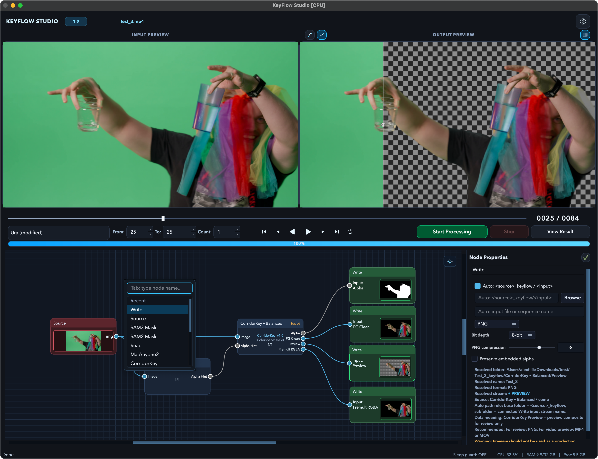

# KeyFlow Studio

KeyFlow Studio is a desktop application for node-based AI video keying, matting, mask generation, and compositing workflows. It combines a Qt user interface with a graph runtime that can orchestrate models and services such as CorridorKey, SAM, BiRefNet, GVM, and MatAnyone2.

The project is currently developed as a private product/research codebase. This repository is being prepared with public-facing documentation and GitHub workflows before any public release.

## Highlights

- Node graph workflow for video keying, matting, mask generation, merge, preview, and export.
- Integrated runtime contracts for model nodes and media-processing nodes.
- Local execution on CPU, Apple Silicon MPS, or NVIDIA CUDA where supported.
- Optional EC2 GPU worker for cloud inference runs.
- Staged execution paths to reduce peak memory pressure when chaining heavy models.
- Regression, smoke, and node-contract tests for key workflows.

## Status

KeyFlow Studio is under active development. APIs, node contracts, model integration details, and packaging behavior may change while the project is being stabilized.

Recommended current use:

- Local development and experimentation.
- Private cloud GPU testing.
- Internal workflow validation.

Not yet recommended:

- Treating the repository as a stable public SDK.
- Publishing model weights or private cloud credentials.
- Depending on undocumented node internals.

## Screenshots



KeyFlow Studio combines input/output preview, frame controls, node graph editing, and per-node output settings in one workspace for keying and compositing workflows.

## Requirements

Core requirements:

- Python 3.11 recommended.
- FFmpeg available on `PATH`.
- macOS, Linux, or Windows depending on the selected model backends.
- Enough RAM/VRAM for the selected workflow and input resolution.

Acceleration options:

- Apple Silicon: MPS or MLX-compatible model paths where supported.
- NVIDIA GPU: CUDA-compatible PyTorch build.
- CPU: useful for tests and lightweight smoke checks, but slow for production video inference.

## Tested Environments

Current validation has been done in two practical environments:

- Local development: Intel macOS on an older i7 Mac, running the app and regression suite in CPU mode.
- Cloud/server worker: NVIDIA CUDA GPU worker, used for end-to-end model workflow checks.

The Intel macOS path uses compatibility pins and small integration patches where newer upstream packages no longer support older architecture constraints cleanly. In particular, the project pins older PyTorch/torchvision on `darwin x86_64`, keeps `numpy<2` there, constrains GVM-related `diffusers`, and includes helper patches/workarounds for model packages that assume newer Linux/CUDA-oriented stacks. See [docs/installation.md](docs/installation.md) and [docs/models.md](docs/models.md) before treating this as a universal production support matrix.

## Quick Start

```bash
git clone https://github.com/hockeytek/KeyFlowStudio.git
cd KeyFlowStudio

python3 -m venv .venv
source .venv/bin/activate
pip install --upgrade pip
pip install -r requirements.txt

python main.py
```

On macOS, install FFmpeg with Homebrew if needed:

```bash
brew install ffmpeg
```

## Model Weights

Model weights are intentionally not stored in this repository. Downloaded weights, checkpoints, and model caches are ignored by `.gitignore`.

KeyFlow Studio checks the configured model cache at runtime and downloads supported weights automatically when they are available from the configured upstream source. Models that require manual license acceptance, private tokens, or external setup should be configured through their model-specific instructions.

Typical local model locations are managed by the application settings or by `KEYFLOW_MODELS_DIR`. See [docs/models.md](docs/models.md) for details.

## Third-Party Models

KeyFlow Studio is an orchestration UI/runtime around several third-party model projects. Those projects and their authors retain their own copyrights, licenses, model terms, checkpoints, and trademarks. This repository does not claim ownership of the upstream models or weights.

Integrated or supported workflows include CorridorKey by `nikopueringer`, BiRefNet by `ZhengPeng7`, GVM by `geyongtao`, MatAnyone2 by `pq-yang`, and Meta/Facebook Research SAM-family models where installed by the user. See [docs/models.md](docs/models.md) for links and attribution details.

## Cloud GPU Worker

The repository includes an optional EC2 worker under [ec2_worker/](ec2_worker/) for headless GPU inference. This is useful when local hardware is not strong enough for final production-sized tests.

Start with [docs/cloud-gpu.md](docs/cloud-gpu.md) before launching cloud resources. Always keep AWS keys outside the repository.

## Project Layout

```text
KeyFlowStudio/
├── main.py                     # Qt application entry point
├── app/
│   ├── coordinators/           # Runtime and UI orchestration
│   ├── node_graph/             # Node specs, rules, engine, panels
│   ├── services/               # Model services and inference backends
│   ├── workers/                # Background execution workers
│   └── utils/                  # Media, device, FFmpeg, write helpers
├── docs/                       # Architecture, setup, and workflow docs
├── ec2_worker/                 # Optional cloud GPU worker
├── scripts/                    # Local validation and helper scripts
├── tests/                      # Unit, smoke, and integration tests
└── UI/                         # Qt UI resources
```

## Development

Run a focused smoke test:

```bash
pytest tests/test_node_graph_dialog_smoke.py -q
```

Run the P1 regression script:

```bash
./run_p1.sh
```

Optional device override:

```bash
./run_p1.sh --device cpu
./run_p1.sh --device mps
./run_p1.sh --device auto
```

## Documentation

- [Architecture](ARCHITECTURE.md)
- [Node Graph Standard](docs/NODE_GRAPH_STANDARD.md)
- [Node Rule Documents](docs/node-rules/)
- [Installation](docs/installation.md)
- [Model Setup](docs/models.md)
- [Cloud GPU Setup](docs/cloud-gpu.md)
- [Troubleshooting](TROUBLESHOOTING.md)
- [Legacy Planning Archive](docs/archive/)
- [Russian README](docs/README.ru.md)

## Security

Do not commit secrets, access keys, model weights, downloaded checkpoints, local settings, generated media, or large test footage. See [SECURITY.md](SECURITY.md) for reporting and handling guidance.

## License

This repository is currently source-available with all rights reserved. See [LICENSE](LICENSE). If an open-source release is planned later, review [docs/public-release-checklist.md](docs/public-release-checklist.md) first.